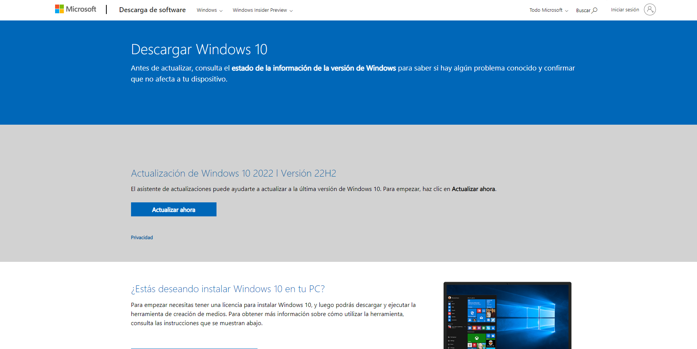

# Instalando windows 10

Esta es mi experiencia instalando windows 10 en virtual box

Noviembre 24 de 2022

## Paso 1

Descargamos el fichero ISO de la herramienta

``windows creation tools``

Descargada de este enlace: [Pulsar aquí](https://www.microsoft.com/es-es/software-download/windows10)

## Paso 2

Al iniciar el programa ``MediaCreationTools22h2`` 

Aparece el siguiente asistente:

## Paso 3

Al seguir los pasos, aceptamos los términos de licencia:

## Paso 4

Seleccionamos crear medios de instalación:

Y le damos a siguiente.

## Paso 5

Seleccionamos el idioma, l arquitectura y la edición (como predeterminado):

## Paso 6

A continuación seleccionamos Archivo ISO:

Y le damos a siguiente:

## Paso 7

A continuación esperamos a que se descargue la ISO:

